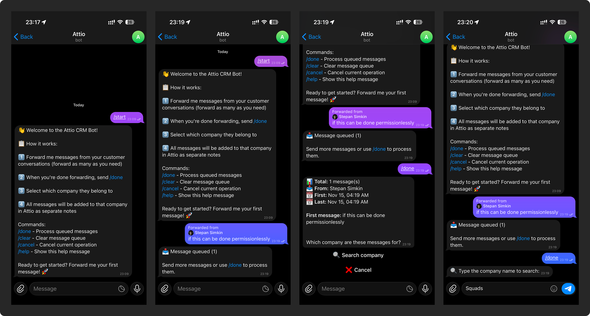
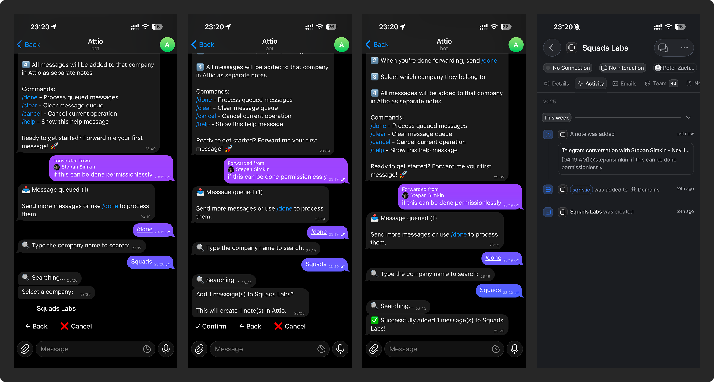

# Telegram → Attio CRM Bot

[](https://opensource.org/licenses/MIT)
[](https://www.typescriptlang.org/)
[](https://vercel.com)

> Forward messages from Telegram and automatically add them to your Attio CRM with just a few taps.




## What It Does

This bot allows you to forward messages from Telegram group chats or direct messages and seamlessly add them to the appropriate company record in your Attio CRM. Perfect for teams that communicate with customers through Telegram and want to keep everything organized in their CRM.

### Use Case

Many teams use Telegram extensively to communicate with customers. Important conversations happen in group chats, and there's often a need for a fast way to capture these interactions in a CRM without manual copy-pasting. This bot makes it instant.

## How It Works

**Single Message:**
```
1. Forward a message to the bot
   ↓
2. Send /done
   ↓
3. Bot asks: "Which company is this for?"
   ↓
4. Search or select from recent companies
   ↓
5. Review and confirm
   ↓
6. ✅ Message added to Attio as a note
```

**Bulk Messages (10+ at once):**
```
1. Forward message 1 → Bot: "📥 Message queued (1)"
2. Forward message 2 → Bot: "📥 Message queued (2)"
3. Forward message 3-10...
   ↓
4. Send /done when you're ready
   ↓
5. Bot: "I received 10 messages. Which company?"
   ↓
6. Select company once
   ↓
7. Confirm batch
   ↓
8. ✅ All 10 messages added to Attio
```

The bot captures all important context:
- Original sender username
- Chat name where message came from
- Timestamp
- Full message content
- Links back to Attio record

## Tech Stack

| Component | Technology | Why |
|-----------|-----------|-----|
| **Language** | TypeScript | Type safety and better developer experience |
| **Bot Framework** | [grammY](https://grammy.dev) | Modern, TypeScript-first, serverless-optimized |
| **Hosting** | [Vercel Serverless](https://vercel.com) | Zero config, free tier, instant deploys |
| **Session Storage** | [Upstash Redis](https://upstash.com) | Serverless-native, generous free tier |
| **CRM** | [Attio API](https://attio.com) | Powerful API for company records and notes |

### Why This Stack?

- **Serverless Architecture:** No servers to manage, scales automatically, pay only for usage
- **TypeScript:** Catch bugs at compile time, better IDE support
- **grammY:** Purpose-built for serverless, excellent conversation management
- **Upstash Redis:** Perfect for ephemeral session state, no connection pooling issues
- **Vercel:** Best-in-class serverless platform with instant deployments

## Project Status

✅ **Production Ready** - Fully functional and tested

### Completed Features

- [x] Research and architecture design
- [x] Tech stack selection
- [x] Project setup and configuration
- [x] Attio API client implementation
- [x] Webhook-based bot with state machine
- [x] Multi-step conversation flow
- [x] Session management with Redis
- [x] Company search and selection
- [x] Message queueing and batch processing
- [x] Clean note formatting (conversation-style)

## Getting Started

### Prerequisites

Before you start, you'll need:

1. **Telegram Bot Token**
   - Message [@BotFather](https://t.me/botfather)
   - Create a new bot and save the token

2. **Attio API Key**
   - Log into [Attio](https://app.attio.com)
   - Go to Settings → Developers → API Keys
   - Create key with permissions:
     - **Object Configuration** (Read) - Required for company search
     - **Record data access** (Read/Write) - Required for reading companies and writing notes

3. **Upstash Redis Database**
   - Sign up at [Upstash](https://upstash.com)
   - Create a Redis database (Global recommended)
   - Copy REST URL and Token

4. **Vercel Account** (for deployment)
   - Sign up at [Vercel](https://vercel.com)
   - Connect your GitHub account

### Installation

```bash
# Clone repository
git clone https://github.com/yourusername/attio-tg.git
cd attio-tg

# Install dependencies
npm install

# Copy environment template
cp .env.example .env.local

# Edit .env.local with your credentials
# BOT_TOKEN, ATTIO_API_KEY, UPSTASH_REDIS_REST_URL, UPSTASH_REDIS_REST_TOKEN
```

### Local Development

```bash
# Type check
npm run type-check

# For local testing, use Vercel CLI
npx vercel dev

# For webhook testing, use ngrok in another terminal
ngrok http 3000

# Set webhook to ngrok URL
curl -X POST "https://api.telegram.org/bot<YOUR_TOKEN>/setWebhook" \
  -H "Content-Type: application/json" \
  -d '{"url": "https://your-ngrok-url.ngrok.io/api/webhook"}'
```

### Deployment

```bash
# Deploy to Vercel
vercel --prod

# Set environment variables in Vercel dashboard

# Set webhook URL
curl -X POST https://api.telegram.org/bot<YOUR_TOKEN>/setWebhook \
  -H "Content-Type: application/json" \
  -d '{"url": "https://your-app.vercel.app/api/webhook"}'
```

## Project Structure

```
attio-tg/
├── api/                      # Vercel serverless functions
│   └── webhook.ts           # Main webhook handler
├── src/
│   ├── bot/                 # Bot logic and handlers
│   ├── conversations/       # Multi-step conversation flows
│   ├── services/            # External services (Attio, Redis)
│   ├── types/               # TypeScript type definitions
│   └── lib/                 # Utilities and config
└── tests/                   # Test files
```

## Usage

Once deployed:

1. **Start a conversation with your bot**
   ```
   /start
   ```

2. **Forward messages to the bot**
   - Forward one or multiple messages
   - From group chats or direct messages
   - Bot queues each: "📥 Message queued (N)"

3. **Process the queue**
   ```
   /done
   ```
   Bot will ask which company these messages are for

4. **Select the company**
   - Search by name
   - Or pick from recently used

5. **Confirm and done!**
   - All messages combined into a single, clean note
   - Note formatted like a natural conversation
   - Link provided to view in Attio

### Available Commands

- `/start` - Get started and see instructions
- `/done` - Process queued messages (starts company selection)
- `/clear` - Clear message queue without processing
- `/cancel` - Cancel current operation
- `/help` - Show help message

## Features

### Current
- ✅ Forward single or multiple text messages
- ✅ Queue-based batch processing with `/done` command
- ✅ Interactive company search with fuzzy matching
- ✅ Recent company suggestions
- ✅ Automatic metadata capture (sender, time, chat)
- ✅ Direct links to Attio records
- ✅ All messages combined into a single, conversation-style note
- ✅ Clean, readable note formatting
- ✅ Webhook-based architecture (serverless-ready)

### Future Enhancements
- [ ] Support forwarded media (images, files, videos)
- [ ] Auto-suggest companies based on chat name
- [ ] Add custom tags to notes
- [ ] Support people records (not just companies)
- [ ] Edit note content before saving
- [ ] Multi-language support

## Contributing

Contributions are welcome! Please see [CONTRIBUTING.md](./CONTRIBUTING.md) for guidelines.

### Ways to Contribute

- 🐛 Report bugs
- 💡 Suggest new features
- 📝 Improve documentation
- 🔧 Submit pull requests
- ⭐ Star the project if you find it useful!

## License

This project is licensed under the MIT License - see the [LICENSE](./LICENSE) file for details.

## Support

For issues or questions:
- Open an [issue on GitHub](https://github.com/yourusername/attio-tg/issues)
- Check existing issues for solutions
- Read the documentation carefully

## Roadmap

See the [Issues](https://github.com/yourusername/attio-tg/issues) page for planned features and known issues.

---

**Built with ❤️ for better CRM workflows**
